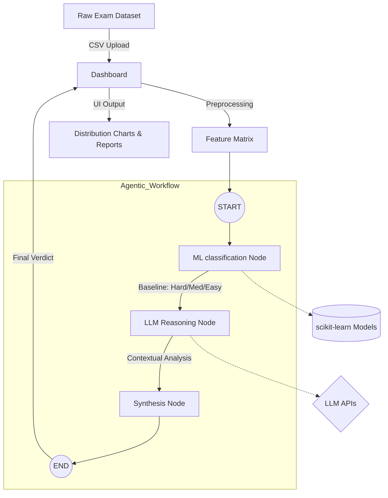

# Exam Analytics Pro: Agentic Difficulty Prediction System 🎓🤖

[](http://localhost:8501)
[](https://www.python.org/downloads/)
[](https://github.com/langchain-ai/langgraph)

Exam Analytics Pro is a high-performance system designed to predict and analyze the difficulty of assessment items using a hybrid approach of **Traditional Machine Learning** and **Agentic AI (LangGraph/LangChain)**.

## 🌟 Key Features

### 1. Hybrid Intelligence Engine
- **Vectorized Inference**: Uses TF-IDF and specialized scikit-learn models (Logistic Regression & Decision Trees) for fast, data-driven baseline predictions.
- **Agentic Reasoning**: Employs a **LangGraph** state machine to orchestrate multi-step analysis by LLMs (OpenAI, Gemini, Groq).
- **Pedagogical Analysis**: Provides deep insights into Bloom's Taxonomy levels, cognitive depth, and linguistic complexity.

### 2. Multi-Provider LLM Support
Switch between state-of-the-art LLM providers seamlessly:
- **Google Gemini**: Reliable and fast pedagogical analysis.
- **Groq (Llama 3)**: Ultra-low latency inference for real-time reasoning.
- **OpenAI (GPT-4o)**: High-fidelity conceptual complexity mapping.

### 3. Interactive Analytics Dashboard
- **CSV Batch Processing**: Upload hundreds of questions for instant difficulty distribution reports.
- **Advanced Insights**: Correlate question length, tag count, and engagement scores with predicted difficulty.
- **Explainable AI**: Click a button to see exactly *why* an AI agent classified a question a certain way.

---

## 🏗️ System Architecture



---

## 🚀 Getting Started

### Prerequisites
- Python 3.12+ 
- Virtual Environment (recommended)

### Installation

1. **Clone the repository**:
   ```bash
   git clone https://github.com/praggCode/Exam-Analytics-System.git
   cd Exam-Analytics-System
   ```

2. **Set up virtual environment**:
   ```bash
   python3 -m venv .venv
   source .venv/bin/activate  # On Windows: .venv\Scripts\activate
   ```

3. **Install dependencies**:
   ```bash
   pip install -r requirements.txt
   ```

### Running the Application

1. **Start the Streamlit Server**:
   ```bash
   streamlit run ui/app.py
   ```

2. **Configure AI Settings**: 
   - Open the app at `http://localhost:8501`.
   - In the sidebar, select your preferred **LLM Provider** (Groq, Gemini, or OpenAI).
   - Enter your **API Key**.

3. **Analyze Data**:
   - Upload a CSV containing a `question` column.
   - Click "Analyze Difficulty" to see ML results.
   - Use the "Generate AI Reasoning" button for a deep-dive analysis of your top questions.

---

## 📁 Project Structure

```text
├── data/               # Processed and raw datasets
├── src/
│   ├── ai_engine.py    # LangGraph workflow definition
│   ├── model_train.py  # Model training pipeline
├── models/             # Saved joblib models (.joblib)
├── ui/
│   ├── app.py          # Streamlit UI implementation
├── requirements.txt    # Project dependencies
└── README.md           # Project documentation
```

---

## 🛠️ Technology Stack
- **Dashboard**: Streamlit
- **ML Framework**: scikit-learn, joblib
- **Orchestration**: LangChain, LangGraph
- **NLP**: Beautiful Soup (BS4), re, TF-IDF
- **Data Science**: Pandas, NumPy, Seaborn, Matplotlib

## 📝 License
This project is for educational and professional assessment analytics. Built with ❤️ and AI.

---
*For a detailed report on the LangChain implementation, see [langchain_report.md](langchain_report.md).*
