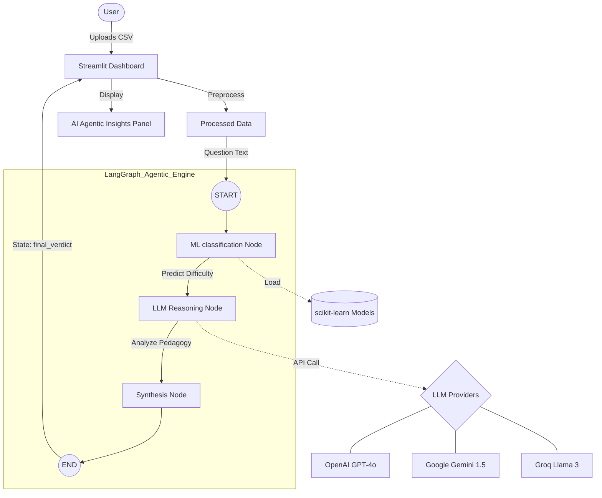
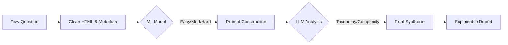

# LangChain & LangGraph Integration Report - Exam Analytics System

This report documents the architectural and functional evolution of the **Exam Analytics System** following the integration of LangChain and LangGraph.

## 1. Executive Summary
The system has transitioned from a static machine-learning classifier to an **Agentic AI System**. While the original version relied solely on numerical vectors (TF-IDF) to predict difficulty, the new version uses an AI Agent to reason about pedagogical concepts, linguistic complexity, and Bloom's Taxonomy.

### Key Benefits
- **Explainability**: Users no longer just see a "Hard/Easy" label; they receive a detailed reasoning of *why*.
- **Multi-Model Support**: Integrated OpenAI, Google Gemini, and Groq for flexible inference.
- **Agentic Workflow**: Uses LangGraph to orchestrate multiple nodes (ML models + LLMs) in a structured state machine.

---

## 2. System Architecture (Mermaid Diagram)

The following diagram illustrates how data flows through the new system.



---

## 3. High-Level Flowchart
The logic sequence for a single question analysis is as follows:



---

## 4. Technical Implementation Details

### A. Graph Nodes
1.  **ML Predictor**: 
    *   Loads `vectorizer.joblib` and `lr_model.joblib`.
    *   Performs traditional inference to establish a baseline.
2.  **LLM Reasoner**: 
    *   Dynamic prompt engineering.
    *   Takes the question + ML prediction as context.
    *   Analyzes structural depth and cognitive demand.
3.  **Synthesizer**: 
    *   Collates outputs into a clean markdown format for the UI.

### B. State Management
We use a `TypedDict` to maintain the state across the graph:
```python
class AgentState(TypedDict):
    question: str
    metadata: dict
    ml_prediction: Optional[str]
    llm_analysis: Optional[str]
    final_verdict: Optional[str]
    api_key: str
    provider: str
```

### C. UI Integration
The Streamlit interface was updated to include:
- **Persistent Session State**: Analysis results are stored in `st.session_state` to prevent data loss during AI reasoning reruns.
- **Provider Switching**: Seamlessly toggle between Google, Groq, and OpenAI.

---

## 5. Summary of New Dependencies
The following libraries were added to `requirements.txt`:
- `langchain`: Core framework for LLM orchestration.
- `langgraph`: State-based graph orchestration for agentic behavior.
- `langchain-community`: For base integrations.
- `langchain-openai`: Support for GPT models.
- `langchain-google-genai`: Support for Gemini models.
- `langchain-groq`: Support for ultra-fast Llama models on Groq.

---
*Report generated on: April 01, 2026*
